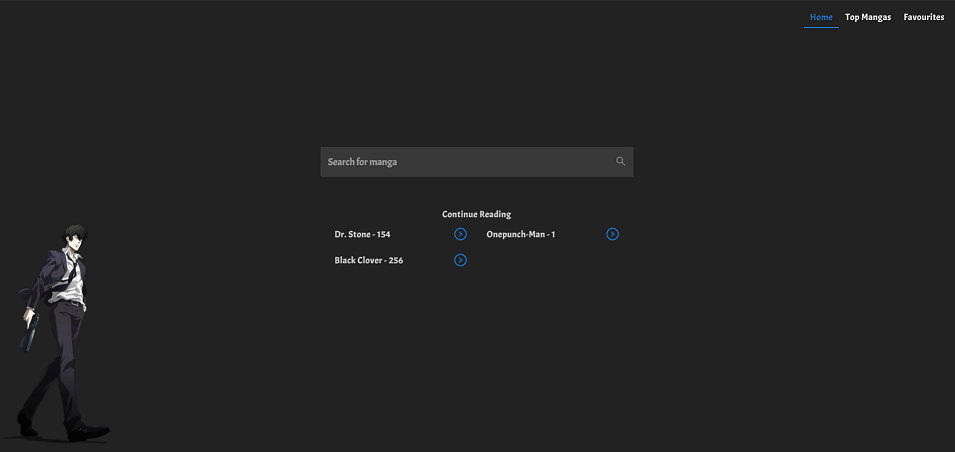
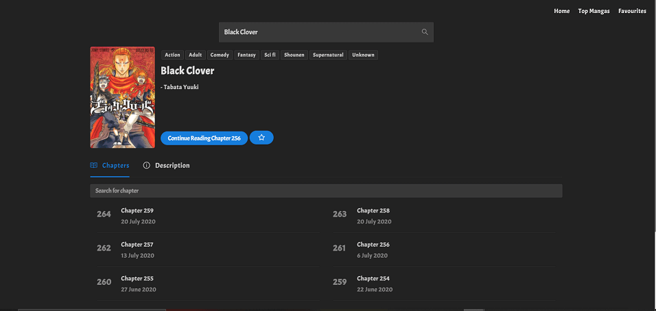
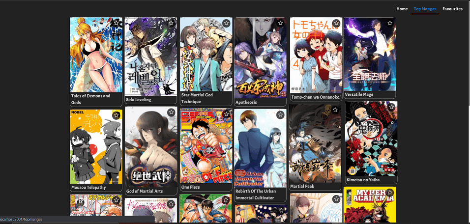

# Manga Net

Manga Net is a PWA app to read all your favourite mangas.
 - Frontend: React JS. Deployed on AWS S3.
 - Backend: Django, Postgres. Deployed on AWS Elastic BeanStalk and RDS.

# Features

  - Search for any manga by name
  - Showcase for top mangas
  - Make your own collection of mangas
  - Continue reading from the place you left
  - Automatically move to next change
  - Support to add the app to your home screen
  - Search for any chapter of a manga by chapter number name or description
  - Highly responsive

